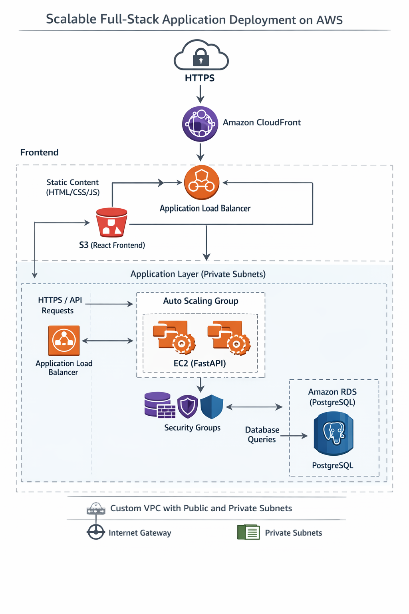

# Scalable Full-Stack Web Application Deployment on AWS

This project demonstrates deploying a **scalable three-tier web application architecture on AWS** using **FastAPI, React, and PostgreSQL**.

The system is designed with **high availability, scalability, and secure network isolation** using core AWS services. The backend runs on EC2 instances behind an Application Load Balancer with Auto Scaling, the database is hosted on Amazon RDS, and the frontend is delivered globally through S3 and CloudFront.

---

# Architecture

## AWS Three-Tier Scalable Web Application Architecture

### Request Flow

1. A user accesses the application through a browser.
2. Requests first reach **Amazon CloudFront (CDN)**.
3. CloudFront retrieves static files from **Amazon S3**, where the React frontend is hosted.
4. API requests are forwarded to the **Application Load Balancer (ALB)**.
5. The ALB distributes traffic across **EC2 instances running FastAPI**.
6. Backend services interact with **Amazon RDS (PostgreSQL)** for database operations.

---

# AWS Services Used

## Networking

* Amazon VPC
* Public Subnets
* Private Subnets
* Internet Gateway
* NAT Gateway

## Compute

* Amazon EC2
* Auto Scaling Group

## Load Balancing

* Application Load Balancer
* Target Groups

## Storage & Database

* Amazon S3
* Amazon RDS (PostgreSQL)

## Content Delivery

* Amazon CloudFront

## Security

* AWS Certificate Manager (HTTPS)
* Security Groups

---

# Key Features

* Scalable backend using **Auto Scaling**
* Traffic distribution with **Application Load Balancer**
* Secure network segmentation using **public and private subnets**
* Managed database using **Amazon RDS**
* Global content delivery using **CloudFront CDN**
* Secure HTTPS communication using **AWS Certificate Manager**

---

# Repository Structure

project/

frontend/ # React application

backend/ # FastAPI backend

infrastructure/ # Architecture documentation

README.md

---

# Deployment Overview

The deployment process includes the following steps:

1. Create a **custom VPC**.
2. Configure **public and private subnets**.
3. Attach an **Internet Gateway** for public access.
4. Deploy a **NAT Gateway** for private subnet outbound access.
5. Launch **EC2 instances with FastAPI backend**.
6. Configure an **Application Load Balancer** with target groups.
7. Enable **Auto Scaling Group** for EC2 instances.
8. Deploy **PostgreSQL using Amazon RDS**.
9. Build the React application and upload it to **Amazon S3**.
10. Configure **CloudFront distribution** for global delivery.
11. Enable **HTTPS using AWS Certificate Manager**.

---

Links:
1. https://github.com/NAVEENS-K/aws-terraform-alb-asg-project.git - for infrastructure
2. https://www.linkedin.com/posts/naveens-k-786aa6327_%F0%9D%97%99%F0%9D%97%BF%F0%9D%97%BC%F0%9D%97%BA-%F0%9D%97%9C%F0%9D%98%81-%F0%9D%97%A6%F0%9D%97%B5%F0%9D%97%BC%F0%9D%98%82%F0%9D%97%B9%F0%9D%97%B1-%F0%9D%97%AA%F0%9D%97%BC%F0%9D%97%BF%F0%9D%97%B8-%F0%9D%98%81%F0%9D%97%BC-activity-7413924684733546496-xHQ8?utm_source=share&utm_medium=member_desktop&rcm=ACoAAFKQvtYBqMWSPC8I63WwNHP-tUIW7qOQx2w - content delevery
3. https://github.com/NAVEENS-K/FastApi_deployment.git - Fastapi deployment

# Future Improvements

* CI/CD pipeline using **GitHub Actions**
* Containerization using **Docker**
* Infrastructure as Code using **Terraform**
* Monitoring using **Amazon CloudWatch**

---

# Author

Naveens
